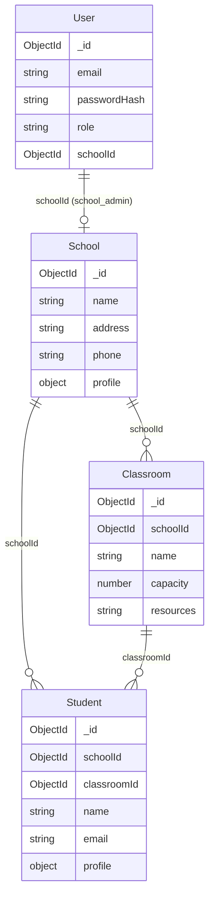

# Database schema (MongoDB)

## Entity relationship (overview)

```
User (1) -----> (0..1) School   [school_admin has one assigned school]
School (1) ----> (*) Classroom
School (1) ----> (*) Student
Classroom (1) --> (*) Student   [student can be in one classroom]
```

## Collections

### User

| Field         | Type     | Required | Description |
|---------------|----------|----------|-------------|
| _id           | ObjectId | -        | Id |
| email         | string   | yes      | Unique |
| passwordHash  | string   | yes      | Bcrypt hash |
| role          | string   | yes      | `superadmin` \| `school_admin` |
| schoolId      | ObjectId | no       | Ref School; set for school_admin |
| createdAt     | Date     | -        | |
| updatedAt     | Date     | -        | |

### School

| Field     | Type   | Required | Description |
|-----------|--------|----------|-------------|
| _id       | ObjectId | -      | Id |
| name      | string | yes      | |
| address   | string | no       | |
| phone     | string | no       | |
| profile   | object | no       | Free-form profile data |
| createdAt | Date   | -        | |
| updatedAt | Date   | -        | |

### Classroom

| Field     | Type     | Required | Description |
|-----------|----------|----------|-------------|
| _id       | ObjectId | -        | Id |
| schoolId  | ObjectId | yes      | Ref School |
| name      | string   | yes      | |
| capacity  | number   | yes      | Min 1 |
| resources | string   | no       | Resource description |
| createdAt | Date     | -        | |
| updatedAt | Date     | -        | |

### Student

| Field        | Type     | Required | Description |
|--------------|----------|----------|-------------|
| _id          | ObjectId | -        | Id |
| schoolId     | ObjectId | yes      | Ref School |
| classroomId  | ObjectId | no       | Ref Classroom (enrolled) |
| name         | string   | yes      | |
| email        | string   | no       | |
| profile      | object   | no       | Free-form profile data |
| createdAt    | Date     | -        | |
| updatedAt    | Date     | -        | |

## Schema diagram 


